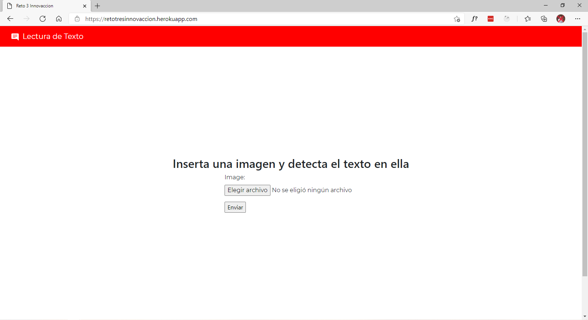
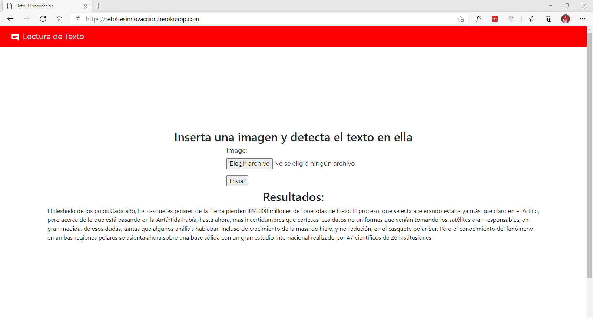
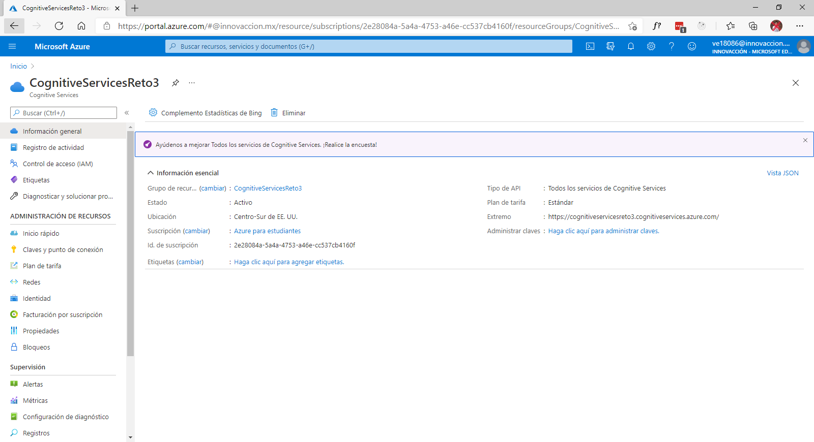

# Reto Semana 3 Innovacción Virtual

Para este reto decidí usar los servicios de Azure Computer Vision que incluye OCR para hacer un sitio web que detecte el texto dentro de una imagen proporcionada por el usuario, cree mi grupo de recursos en Azure Portal, conseguí mis claves y endpoint para implementarlo en una pagina web.

## Pagina web
Use el framework de Python llamado Django para crear un sitio sencillo con un formulario para que el usuario solamente suba la fotografía y se llame a la API de OCR, posteriormente se desplegarían los resultados del texto contenido en la imagen.

[Link al sitio web](https://retotresinnovaccion.herokuapp.com/)

## Capturas del funcionamiento

## Recurso en Azure

